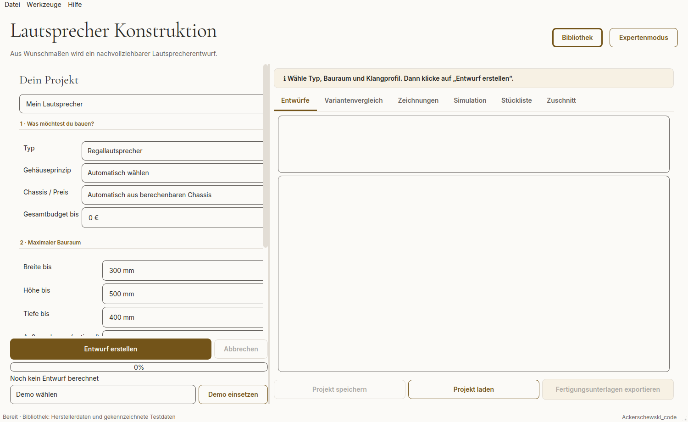
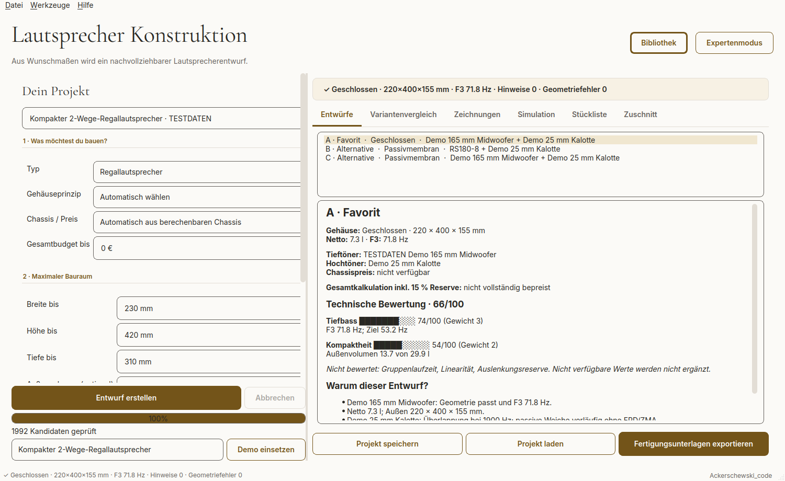
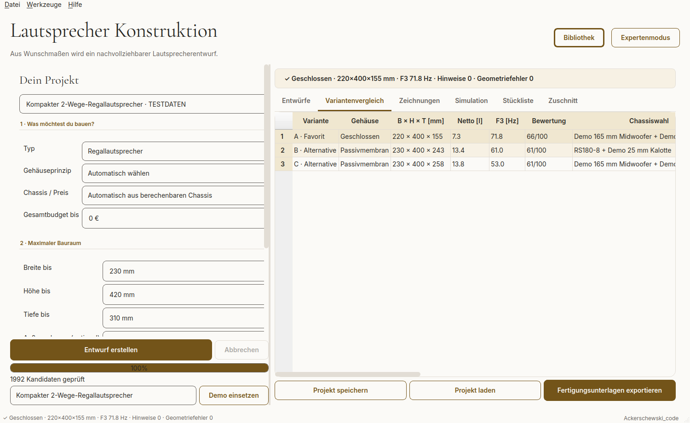
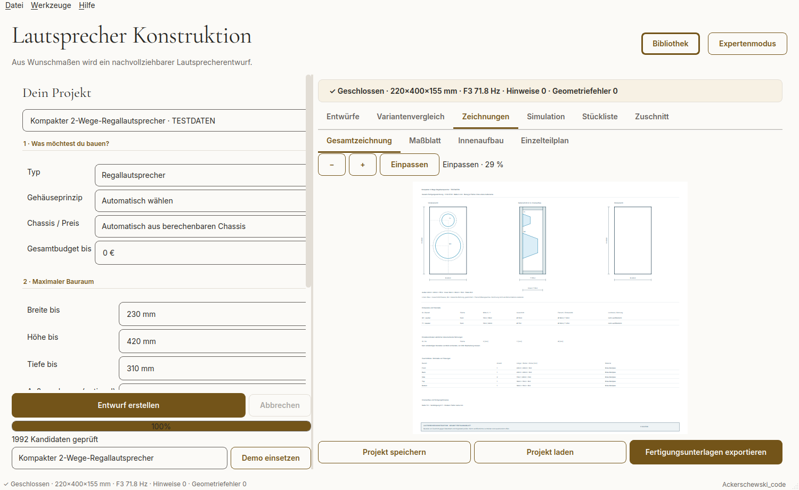
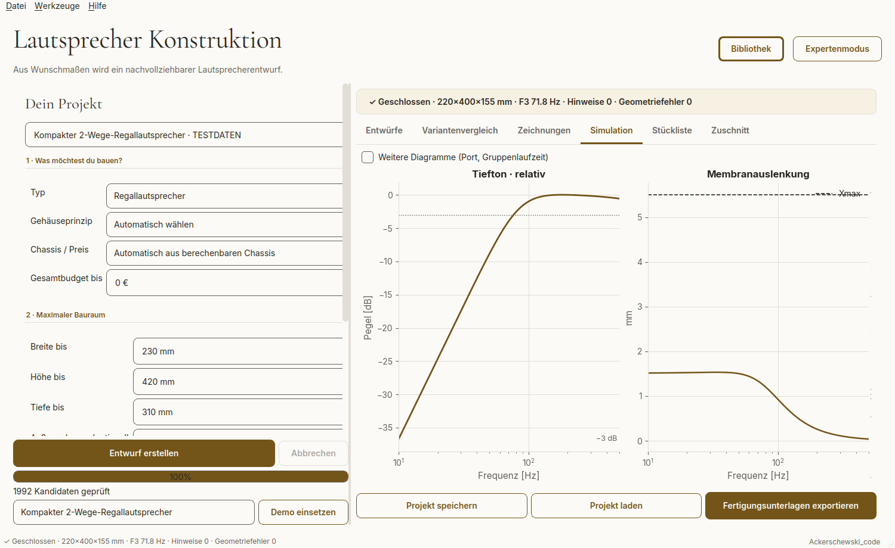
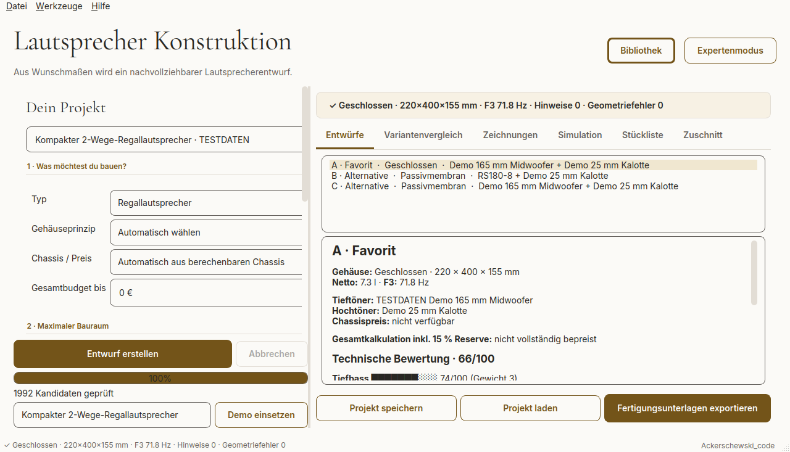
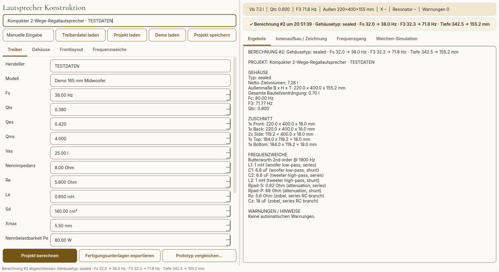
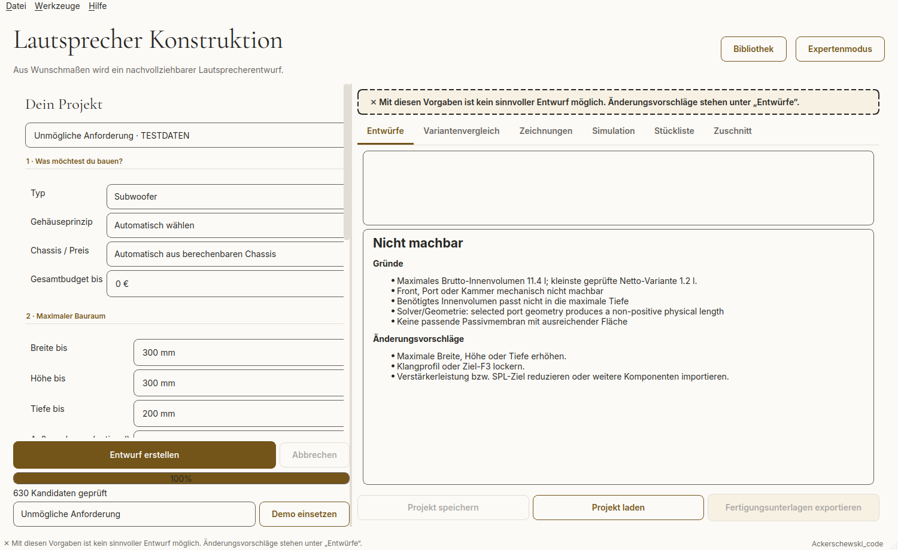
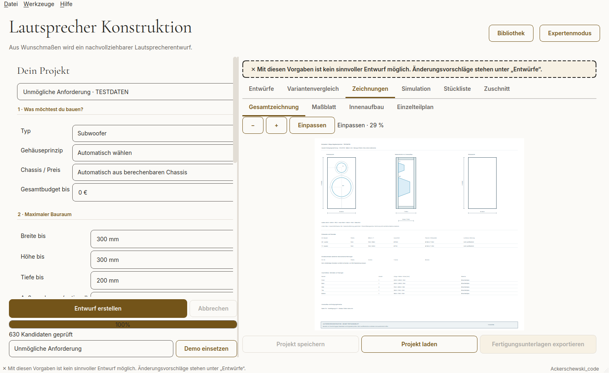

# Lautsprecher-UI – Nutzerfeedback, Review und Bewegungsplan

Datum: 06.10.2026. Ziel: eine hochwertige, angenehme ACK-Studio-Anwendung, mit der man gern einen Lautsprecher entwickelt und deren Zeichnungen direkt lesbar sind.

## Direkte Rückmeldung des Nutzers

> Allgemein finde ich die UI sieht noch sehr technisch aus und ich glaube als Nutzer hätte man nicht wirklich Spaß aktuell, gerade weil man auch die Zeichnungen gar nicht lesen kann, weil alles so klein ist.

Auftrag: die vorherige Review im Repository als Feedback ablegen und um konkrete Animationen ergänzen.

## Grundlage und Prüfumfang

Geprüfter Code: `b2e03d89b4829466dc3838764edd6e30d81e9fa2`, Branch `claude/modest-bell-guqoxu` im Repository `Unternehmen-Lautsprecher-konzepte`. Dies ist ein Snapshot-Review, keine Aussage, dass spätere Commits bereits nachgeprüft sind. Die Rückmeldung wird auf dem aktuellen Entwicklungsbranch abgelegt.

Original-PySide6-Oberfläche lokal unter Qt/Linux offscreen gerendert, mit den mitgelieferten Inter-/Cormorant-Fonts und dem tatsächlichen Berechnungskern. Die Screenshots sind echte Widget-Aufnahmen, kein nachgebautes Mockup. Kein vollständiger Windows-/DPI-, Screenreader- oder Maus-/Tastatur-End-to-End-Test. Native Details können auf Windows anders aussehen; fehlende Pfeilsymbole unter Offscreen wurden nicht als Windowsfehler eingestuft. Akustische Richtigkeit und Fertigungsreife sind kein Ergebnis dieser UI-Review.

## Urteil

Farbwelt und Schriftfamilien passen zum aktuellen ACK-Studio-Paket. Es braucht jedoch eine Überarbeitung von Hierarchie, Arbeitsfläche und Ergebnisdarstellung. Animation allein beseitigt die überladenen Formulare und die zu kleinen Zeichnungen nicht.

Beibehalten: warmer weißer Grund, dunkles Konstruktion-Senfgelb, Serif für ausgewählte Titel, Inter für Bedienung, sichtbare Hauptaktion, optionaler Expertenmodus und die ruhige Diagrammgestaltung.

## Priorisierte Befunde

- **P1 – Veraltete Zeichnung nach Fehlschlag:** Neuberechnung darf keine unmarkierten alten Ergebnisse hinterlassen. Reproduktion: Regallautsprecher-Demo berechnen → unmögliche Demo berechnen → Zeichnungen öffnen.
- **P1 – Formular-/Fensterlayout:** Seitlich abgeschnittene Controls und unnötig große Mindestfenster beheben. Kernangaben und primäre Aktion auf Laptopauflösung erreichbar halten.
- **P1 – Lesbarkeit der Fortschrittsanzeige:** Text #282723 auf gefülltem Akzent #735419 ergibt ca. 2,14:1. Fortschrittstext außerhalb des Balkens oder kontrastreich darstellen.
- **P2 – Ergebnisdarstellung:** Visualisierung plus wenige Kennwerte, Kosten-/Datenqualität und klare Empfehlung. Technische Details einklappbar.
- **P2 – Vergleich und Fehlerführung:** Entscheidungsrelevante Spalten zuerst; lesbare Fehlermeldungen mit Bezug zu Eingaben.
- **P2 – Icons und Markenkonsistenz:** Eigene verständliche Outline-Icons mit Text für Bibliothek, Entwurf, Zeichnungen, Simulation und Export. Alter Footername Ackerschewski_code steht noch im Programm.
- **P3 – Bewegung und Feinschliff:** Keine Website-Slideshow in die Fachanwendung übernehmen. Kurze Rückmeldung bei Berechnung und Aktualisierung genügt. Bewegungsreduktion unterstützen.

## Ansichten und konkrete Verbesserungen

### 1 · Einstieg – Überarbeitungsbedürftig

**Beobachtet:** Die warmweiße Fläche, Cormorant-Titel und der Konstruktion-Akzent stimmen mit ACK Studio überein. Die beiden großen leeren Ergebnisfelder wirken dagegen unfertig. Das Klangprofil als eine der drei Haupteingaben liegt unterhalb des sichtbaren Formularbereichs. Rechts abgeschnittene Eingabefelder sind bereits bei 1500 × 920 sichtbar.

**Ändern:** Leeren Ergebnisraum durch kurze Anleitung und ein Beispiel ersetzen. Typ, maximale Maße und Klangprofil gemeinsam sichtbar machen. Formularspalten an verfügbare Breite anpassen; primäre Aktion unten erreichbar lassen.

### 2 · Berechneter Entwurf – Funktioniert, schlecht aufbereitet

**Beobachtet:** Der Regallautsprecher-Demolauf liefert drei Varianten aus 1992 geprüften Kandidaten. Die Auswahl funktioniert, doch Ergebnisdetails sind ein dichter HTML-Bericht mit Unicode-Balken und vielen gleichgewichtigen Zeilen. Kosten sind unbekannt und mehrere Qualitätskriterien unbewertet; trotzdem wirkt 66/100 wie eine umfassende Qualitätsnote. Die permanente 100%-Leiste beansprucht Platz und hat dunkle Schrift auf dunklem Senf.

**Ändern:** Oben Visualisierung, Maße, F3, Kostenstatus und Datenqualität zeigen. Score als Teilbewertung kennzeichnen; berechnete/fehlende Kriterien explizit anzeigen. Details einklappen. Fortschrittsleiste nach Abschluss durch kurzen Status ersetzen. Native Balken statt Textzeichen verwenden.

### 3 · Variantenvergleich – Deutlich überarbeitungsbedürftig

**Beobachtet:** Die drei Zeilen stehen in einer elfspaltigen Tabelle mit sehr breiten automatisch angepassten Spalten. Chassisnamen, Kosten, Budget und Hinweise sind teilweise nur durch horizontales Scrollen erreichbar. Der Großteil der Höhe bleibt ungenutzt.

**Ändern:** Standardansicht auf Variante, Gehäuse, Maße, F3, Gesamtkosten und Prüfstatus begrenzen. Namen umbrechen, relevante Unterschiede hervorheben; Zusatzwerte per Detailansicht. Eingabepanel für den Vergleich einklappbar machen.

### 4 · Zeichnungen – Grundfunktion gut, Arbeitsfläche zu klein

**Beobachtet:** Gesamtzeichnung, Maßblatt, Innenaufbau und Einzelteilplan sind sinnvoll getrennt. Zoom und Einpassen sind vorhanden. Die Gesamtzeichnung wird aber nur mit 29 % dargestellt; Beschriftungen sind kaum lesbar. Das große Eingabeformular und zwei Reiterleisten reduzieren die Zeichenfläche.

**Ändern:** Ergebnis-/Zeichnungsmodus mit einklappbarem Formular und größerer Zeichenfläche. Seitenbreite, 100 % und Einpassen als klare Zoomoptionen. Kennwerte auch außerhalb des Druckblatts lesbar anzeigen; Druckzeichnung separat behandeln.

### 5 · Simulation – Visuell am stimmigsten

**Beobachtet:** Zwei gut gegliederte Diagramme, passende Papierfläche und Akzentkurve. Einheiten und Grenzlinie sind sichtbar, Zusatzdiagramme optional. Die zugrunde gelegte Leistung und die Grenzen einer relativen Tieftonkurve sind in dieser Ansicht nicht ausreichend präsent.

**Ändern:** Leistung, Datenquelle und Gültigkeitsbereich direkt über den Diagrammen nennen. Diese Farb-/Rastergestaltung als Vorbild für die übrigen technischen Ergebnisansichten verwenden.

### 6 · Kleineres Fenster – Problematisch

**Beobachtet:** Eine angeforderte Größe von 1280 × 720 wird auf 1280 × 733 begrenzt. Der Pflichtteil zum Bauraum verschwindet fast vollständig unter dem Scrollbereich. Eingabefelder werden weiterhin seitlich abgeschnitten. Zwei unabhängig scrollende Arbeitsbereiche erschweren den Überblick.

**Ändern:** Minimumbreiten der Formularinhalte und QFormLayout prüfen. Unter definierten Breiten Formular/Ergebnis umschaltbar machen oder untereinander anordnen. Zieltest: 1280 × 720 ohne seitlich abgeschnittene Controls; zusätzlich Windows 125 % und 150 % Skalierung prüfen.

### 7 · Expertenmodus – Fachlich umfangreich, gestalterisch unfertig

**Beobachtet:** Das Fenster erweitert sich auf etwa 1651 × 900. Links stehen sehr viele Eingabefelder, rechts überwiegend unstrukturierter Ergebnistext mit englischen internen Bezeichnungen wie sealed, Back, Top und woofer. Warnungen, Berechnungsstand und Kennwerte wiederholen sich in mehreren Leisten.

**Ändern:** Expertenmodus in klar getrennte Aufgaben gliedern. Ergebnisse als echte Kennwerte, Tabellen und Warnungsliste statt als Textausdruck. Deutsche sichtbare Begriffe; Detailbezeichnungen für Fachwerte mit Tooltips. Maximal verfügbare Bildschirmgröße beachten.

### 8 · Nicht machbare Vorgaben – Teilweise gut

**Beobachtet:** Die unmögliche Demo wird abgewiesen; Export und Speichern sind deaktiviert. Die Meldung enthält aber ungefilterte englische Solvertexte. Änderungsvorschläge bleiben allgemein; die leere Variantenliste beansprucht weiterhin Höhe.

**Ändern:** Fehler auf die betroffene Eingabe zurückführen. Verständliches Deutsch, technische Originalmeldung in aufklappbaren Details. Konkrete Grenzwerte nur nennen, wenn vom Solver belegt. Leere Variantenliste ausblenden und Abhilfen neben den Feldern zeigen.

### 9 · Zeichnung nach fehlgeschlagener Neuberechnung – Hohe Priorität: widersprüchlicher Zustand

**Beobachtet:** Nach dem Wechsel vom erfolgreich berechneten Regalmodell zur unmöglichen Subwoofer-Demo zeigt der Reiter Zeichnungen weiterhin das alte Regalmodell. Laufzeitprüfung: designs ist leer, der SVG-Renderer enthält weiterhin eine gültige Zeichnung, Export ist gesperrt. Banner und angezeigte Geometrie beziehen sich damit auf verschiedene Projekte.

**Ändern:** Beim Start bzw. Fehlschlag alle Ergebnisansichten konsistent invalidieren. Alte Ergebnisse entweder löschen oder ausdrücklich als vorherigen, nicht aktuellen Entwurf kennzeichnen. Dasselbe für Simulation, Stückliste und Zuschnitt prüfen; Export-Sperre beibehalten.

## Zielbild: angenehm entwickeln statt Formulare abarbeiten

1. **Projekt starten:** Name, Lautsprechertyp, maximaler Bauraum und Klangprofil sind in einem überschaubaren Einstieg sichtbar. Seltene Werte liegen unter „Weitere Anforderungen“. Eine kleine Kontextskizze oder später eine geprüfte Gehäusevorschau hilft beim Verständnis; kein riesiger dekorativer Website-Hero.
2. **Entwurf verstehen:** Auf der Ergebnisfläche steht eine große Gehäuseansicht. Daneben höchstens fünf zentrale Kennwerte: Maße, Tiefbass/F3, Preisstatus, Datenqualität und Prüfstatus. „Warum empfohlen?“ erklärt kurz den Vorschlag. Vollständige Herleitung bleibt aufklappbar.
3. **Varianten auswählen:** Drei kompakte Variantenkarten oder eine reduzierte Vergleichstabelle; Unterschiede wie kleiner, tieferer Bass und günstigere bekannte Kosten sind direkt erkennbar. Unbekannte Preise nicht als günstiger behandeln. Die Bewertung muss unbewertete Kriterien nennen und darf keine vollständige Qualitätsfreigabe suggerieren.
4. **Zeichnung bearbeiten:** „Zeichnungsmodus“ klappt die Eingabeseite ein. Papier, Modell und Maßdetails werden ausreichend groß dargestellt. Gesamtblatt dient der Übersicht; jede Ansicht/Einzelteilzeichnung ist separat aufrufbar. Browserartige Dokumentnavigation und native Qt-Zoom/Pan-Funktionen verwenden.
5. **Fertigung vorbereiten:** Prüfstatus und offene Fragen vor dem Export bündeln. Export wird nur nach den bestehenden geometrischen Prüfregeln freigegeben. Eine aktuelle Zeichnung darf nicht mit einem alten oder gescheiterten Berechnungsstand verwechselt werden.

### Lesbare Zeichnungen – höchste gestalterische Priorität

- Zeichnungsarbeitsfläche übernimmt im Fokusmodus den verfügbaren Inhaltsbereich; Formular und lange Statusleisten werden einklappbar.
- Ansicht auf das eigentliche Bauteil/den Schnitt anpassen, statt nur ein vollständiges dichtes Druckblatt winzig einzupassen. Für den Bildschirm eine Lesedarstellung anbieten; PDF-/Druckmaßstab bleibt unverändert.
- Klare Controls: „Einpassen“, „Seitenbreite“, „100 %“, Zoom-Prozent als editierbarer Wert; Zoom per Mausrad am Mauszeiger und Pan mit eindeutiger Bedienhilfe.
- Einzelansichten/Einzelteile über benannte Navigation auswählen. Bemaßungen bei Auswahl zusätzlich in einer lesbaren Detailleiste anzeigen. Keine Maße durch Skalieren des Bildes neu interpretieren oder erfinden.
- Änderungen im Formular markieren vorhandene Unterlagen sofort als veraltet. Fehlschlag leert die neue Ergebnisfläche oder kennzeichnet das vorherige Ergebnis eindeutig inklusive altem Projektnamen/Berechnungsstand.
- Technische Linien, Bemaßung und Text dürfen in der UI andere Bildschirmgrößen haben als im Druckexport, müssen aber dieselben geprüften Modelldaten zeigen.

## Ziel-Design V3 – vom technischen Tool zum hochwertigen ACK-Studio-Planer

Die nächste UI-Runde soll **nicht** nur Farben, Abstände und Buttonradien polieren. Ziel ist ein struktureller Umbau vom klassischen technischen Desktoptool hin zu einem hochwertigen, verständlichen Produktplaner mit klarer ACK-Studio-Wiedererkennung.

### Designziel

Die Anwendung soll sich anfühlen wie:

> **„ACK Studio hat ein eigenes professionelles Produktdesign-Werkzeug gebaut.“**

Nicht wie:

> **„Eine PySide-Anwendung hat nachträglich ACK-Studio-Farben bekommen.“**

Die Website dient dabei als Markenreferenz, nicht als direkt zu kopierendes Layout. Keine Marketing-Heros, Ticker oder Slideshow in die Fachanwendung übernehmen.

### Markenübertragung aus der ACK-Studio-Website

Für die App folgende Rollen vorsehen:

- **Software-Navy** als primäre App-Chrome-/Arbeitsflächenfarbe im Dark Mode;
- **warme Papierflächen** für Dokumente, Karten, Detailflächen und Light Mode;
- **Konstruktions-Ocker** als aktiver technischer Akzent und Primäraktion;
- **Waldgrün** für valide/geprüfte Zustände und ausreichend Reserve;
- **Burgunder** nur gezielt für Marke, kritische Zustände oder besondere Hervorhebung;
- **Cormorant** nur für große Seitentitel und wenige hochwertige Überschriften;
- **Inter** für Bedienung, Tabellen, Kennwerte, Formulare und technische Inhalte.

Keine großflächige fast-schwarze + braune CAD-Optik als alleinige Designsprache. Die App soll visuell näher an der Software-/Konstruktionswelt der Website liegen.

### Grundlayout nach einer Berechnung

Nach erfolgreicher Berechnung soll sich die Oberfläche vom Eingabeformular in einen Planungsarbeitsplatz verwandeln.

**Empfohlenes Desktoplayout:**

- **linke Spalte ca. 260–300 px:** kompakte, einklappbare Anforderungen / „Entwurf ändern“;
- **Mitte als größte Fläche:** Lautsprecher-/Gehäusevisualisierung, Geometrie, Graph oder Zeichnung;
- **rechte Spalte ca. 300–340 px:** zentrale Kennwerte, Prüfstatus, Kosten, Reserve und Kontextaktionen;
- **oben:** reduzierte Arbeitsnavigation;
- **unten:** nur kontextbezogene Aktion, keine permanente Dateiverwaltungsleiste.

Das aktuelle starre „großes Formular links + Bericht rechts“ soll nicht das Standard-Arbeitsmodell bleiben.

### Einstieg / Projektassistent

Der leere Ergebnisbereich auf der Startseite soll vollständig entfallen.

Stattdessen ein visuell geführter Projektstart:

1. **Was möchtest du bauen?**
   - große Auswahlkarten, z. B. Regallautsprecher, Standlautsprecher, Subwoofer, Center, Monitor;
   - optional kleine vereinfachte Silhouetten/Illustrationen.

2. **Wie viel Platz hast du?**
   - Breite / Höhe / Tiefe;
   - kleine proportionale Gehäusegrafik aktualisiert sich direkt;
   - Volumen nur ergänzend, nicht als dominierende Haupteingabe.

3. **Wie soll er klingen?**
   - verständliche Klangprofile als Karten/Presets;
   - später direkter Übergang zur Zielkurve im Klang-Labor.

4. **Weitere Anforderungen**
   - seltene technische Parameter erst aufklappen;
   - Kosten, Bauweise, Material, maximale Leistung etc.

Primäraktion klar und groß: **„Entwurf erstellen“**.

### Entwurfsansicht

Der Nutzer soll zuerst den **Lautsprecher** sehen, nicht einen langen Bericht.

Zielaufbau:

- große Front-/Gehäusevisualisierung oder später 3D-Ansicht;
- daneben höchstens fünf zentrale Kennwerte:
  - Außenmaße;
  - F3 / Tiefbass;
  - Preisstatus;
  - Datenqualität;
  - Prüfstatus / Reserve;
- sichtbare Empfehlung: **„A · Empfohlener Entwurf“**;
- kurze Begründung in 2–3 verständlichen Aussagen;
- Schaltfläche **„Warum empfohlen?“** für technische Herleitung;
- vollständige technischen Details einklappbar.

Die bestehende lange Textausgabe soll nicht das primäre Ergebnisformat sein.

### Variantenvergleich

Für wenige Kandidaten standardmäßig **Vergleichskarten statt Excel-artiger Tabelle**.

Beispielstruktur:

**A · Empfehlung**
- kompaktester geeigneter Entwurf;
- F3 72 Hz;
- aktueller Platzbedarf;
- Reserve / Prüfstatus.

**B · Mehr Tiefbass**
- +10 mm Breite;
- −11 Hz F3;
- höheres Volumen.

**C · Tiefster Bass**
- +103 mm Tiefe;
- −19 Hz F3;
- mögliche Mehrkosten / Portbedarf.

Wichtige Unterschiede visuell hervorheben.

Erst über **„Alle technischen Daten“** die detaillierte Tabelle öffnen.

Tabellen:
- keine hellen systemfremden Flächen im Dark Mode;
- keine horizontalen Scrollmonster als Standard;
- nur entscheidungsrelevante Spalten zuerst.

### Zeichnungsbereich

Zeichnungen erhalten einen echten Viewer statt eines kleinen eingebetteten Druckblatts.

Zwei klar getrennte Darstellungen:

**Lesemodus**
- UI-optimierte technische Ansicht;
- Bauteil/Schnitt füllt den verfügbaren Bereich;
- Maßtexte in normal lesbarer UI-Größe;
- direkte Navigation zu Front, Seite, Innenaufbau, Einzelteilen;
- Zoom am Mauszeiger, Pan, 100 %, Seitenbreite, Einpassen.

**Druckblatt**
- exakte A4/A3-/PDF-Darstellung für Exportkontrolle;
- bewusst separat vom Lesemodus.

Optional links:
- schmale Thumbnail-/Ansichtsleiste;
- Front;
- Seitenansicht;
- Innenaufbau;
- Einzelteile;
- Gesamtblatt.

Beim Wechsel in „Zeichnungen“ soll der Fokusmodus automatisch sinnvoll greifen; „Eingaben anzeigen“ ist dann eine Option statt ein permanenter großer Button.

### Navigation vereinfachen

Arbeitsnavigation auf wenige klare Bereiche reduzieren, z. B.:

**Planen | Varianten | Klang & Simulation | Zeichnungen | Fertigung**

Sekundäre Bereiche wie Stückliste und Zuschnitt können innerhalb von „Fertigung“ liegen.

Nicht gleichrangig behandeln:
- Zeichnungsmodus = Arbeitszustand;
- Bibliothek = eigener Bereich;
- Expertenmodus = Einstellung.

Empfehlung:
- Bibliothek als echter Navigationsbereich mit Icon;
- Expertenmodus in Einstellungen bzw. als kompakter „Normal / Expert“-Schalter;
- Zeichnungs-/Fokusmodus kontextabhängig automatisch.

### Dateiverwaltung / untere Leiste

Die permanente Dreierleiste

- Projekt speichern;
- Projekt laden;
- Fertigungsunterlagen exportieren

soll nicht auf jeder Seite gleich dominant bleiben.

Besser:
- **Autosave / Projektzustand automatisch sichern**;
- „Öffnen/Laden“ in Datei-/Projektmenü;
- explizite Speicherbestätigung nur bei Bedarf;
- Export erst im Bereich **Fertigung** als starke Hauptaktion;
- nach Export kurze hochwertige Bestätigung mit Dateipfad und „Ordner öffnen“.

### Standard-Qt-Look reduzieren

Folgende Elemente müssen konsequent an das Designsystem angepasst werden:

- Scrollbars;
- Spinboxes;
- Comboboxen;
- Checkboxen;
- Tabellenheader;
- Tabellen-Selektion;
- Fokuszustände;
- Tooltips;
- Kontextmenüs;
- leere Zustände;
- Fehlermeldungen;
- Splitter;
- Tabs;
- native Rahmen.

Keine systemfremden weißen Tabellenflächen im Dark Mode.

Ziel: Bedienelemente sollen nicht nach Standard-Qt aussehen, aber weiterhin klar, zugänglich und tastaturbedienbar bleiben.

### Karten und Flächen

Weniger einzelne dünn gerahmte Kästen.

Stattdessen:
- größere zusammenhängende Flächen;
- klare Hierarchie über Abstand, Typografie und Hintergrund;
- Kartenradius grob 12–14 px;
- Linien nur dort, wo sie Struktur erklären;
- Statuskarten sparsam einsetzen;
- Hauptinhalt visuell dominanter als Navigation und Formular.

### Dark- und Light-Mode

**Dark Mode** als bevorzugte visuelle Leitvariante:
- nicht fast-schwarz, sondern tiefes Software-Navy;
- warme/helle Dokumentflächen dürfen bewusst als Kontrast erscheinen;
- Ocker für aktive technische Aktionen;
- Grün für valide Zustände.

**Light Mode**:
- warme Papierbasis statt neutralem Standardweiß;
- ausreichend Kontrast;
- keine klassische „Office Engineering Software“-Anmutung.

Beide Modi müssen dieselbe Informationshierarchie besitzen.

### Ergebniszustände

Leere, laufende, erfolgreiche und fehlerhafte Zustände sollen jeweils bewusst gestaltet sein:

- **leer:** hilfreiche Anleitung / Beispiel statt leerem Rechteck;
- **Berechnung läuft:** echter Fortschritt oder klarer Schrittext;
- **erfolgreich:** Visualisierung + zentrale Kennwerte;
- **nicht machbar:** verständliche Ursache + direkte nächste Aktion;
- **veraltet:** alte Ergebnisse eindeutig als nicht aktuell markieren;
- **unvollständige Daten:** Unsicherheit sichtbar, keine Scheinpräzision.

### Hochwertige Microinteractions

Nur dezente funktionale Bewegung:

- Hover: 120–160 ms;
- Panel-/Tabwechsel: 120–220 ms;
- Variantenauswahl: kurzer Crossfade;
- Visualisierungsupdate: 180–240 ms;
- Zeichnung einpassen: kontrollierter Zoom;
- Exportbestätigung: kurze Einblendung;
- keine dauerhaft pulsierenden Elemente;
- keine künstlich hochzählenden Werte;
- keine Slideshow;
- Reduced-Motion berücksichtigen.

### Reihenfolge für den Designumbau

1. **Informationsarchitektur und Layout** ändern;
2. Startassistent visuell neu aufbauen;
3. Entwurfsseite auf Visualisierung + Kennwerte umstellen;
4. Variantenkarten umsetzen;
5. Zeichnungsviewer umbauen;
6. Navigation und Dateiverwaltung vereinfachen;
7. Design-Tokens / Website-Farblogik sauber übernehmen;
8. Standard-Qt-Look entfernen;
9. Microinteractions und Motion ergänzen;
10. erst danach Pixel-Politur.

### Design-Abnahmekriterien

- [ ] Startseite enthält keinen großen leeren Ergebnisrahmen.
- [ ] Nutzer erkennt innerhalb weniger Sekunden, welche drei Schritte zum ersten Entwurf führen.
- [ ] Nach Berechnung ist eine Lautsprecher-/Gehäusevisualisierung der dominante Inhalt.
- [ ] Technische Langtexte sind sekundär und aufklappbar.
- [ ] Varianten A/B/C lassen sich ohne horizontales Scrollen verstehen und vergleichen.
- [ ] Zeichnungen sind im Lesemodus ohne extremes Zoomen nutzbar.
- [ ] Dark Mode enthält keine systemfremden hellen Tabellen-/Widgetflächen.
- [ ] App-Chrome, Zustände und Akzente nutzen nachvollziehbar Navy / Papier / Ocker / Grün / Burgunder.
- [ ] Bibliothek, Expertenmodus und Zeichnungsmodus sind nicht mehr als drei gleichartige Hauptbuttons behandelt.
- [ ] Laden/Speichern blockieren nicht permanent wertvolle Arbeitsfläche.
- [ ] Standard-Qt-Elemente wirken visuell konsistent mit dem ACK-Studio-Designsystem.
- [ ] 1280×720 bleibt funktional; 1366×768 und 1920×1080 wirken nicht leer oder überdehnt.
- [ ] UI wirkt auch ohne Animation hochwertig; Motion ist nur Verfeinerung.

## Interaktive Fullrange-Klangabstimmung – Kernfunktion für den Planer

Die bisherige Tieftonsimulation soll zu einem vollbreiten **Klang- und Optimierungsarbeitsbereich** ausgebaut werden. Ziel ist nicht nur ein Frequenzgang von ungefähr 20 Hz bis 20 kHz, sondern eine Oberfläche, in der der Nutzer seine gewünschte Zielkurve direkt bearbeiten und gleichzeitig verstehen kann, **welche Baugruppe welchen Frequenzbereich überhaupt verändern kann**.

### Grundprinzip

Im Hauptdiagramm werden drei Ebenen unterschieden:

1. **Aktuell berechneter Frequenzgang** des gewählten Entwurfs.
2. **Zielkurve** des Nutzers, die EQ-artig mit wenigen Ankerpunkten oder parametrischen Bändern verändert werden kann.
3. **Erreichbarkeits-/Einflussbereiche**, die zeigen, wie stark der aktuelle Entwurf durch Änderungen an Gehäuse, Chassis, Frequenzweiche oder DSP beeinflusst werden kann.

Die Zielkurve darf nicht suggerieren, dass jede Abweichung über das Gehäuse korrigiert werden kann. Die UI und der Solver müssen transparent trennen, welche physikalische Stellgröße relevant ist.

### Mehrere Analyse- und Bearbeitungsmodi

Im Bereich **Klang & Simulation** soll der Nutzer zwischen folgenden Modi wechseln können:

#### 1. Gesamtmodus

- zeigt aktuellen Frequenzgang, Zielkurve und kombinierte technische Grenzen;
- Solver darf alle vom Nutzer freigegebenen Stellgrößen betrachten;
- ideal für „Mach meinen Entwurf möglichst nah an diese Klangkurve“;
- jede vorgeschlagene Änderung muss als konkrete Änderung an Geometrie, Chassis, Weiche oder DSP nachvollziehbar sein.

#### 2. Gehäusemodus

Zeigt ausschließlich den akustischen Einfluss, der mit Änderungen am Gehäuse erreichbar ist.

Mögliche Stellgrößen:
- Nettovolumen;
- Bassreflex-Abstimmung;
- Portfläche und Portlänge;
- Passivmembranparameter;
- Dämpfung;
- begrenzt Schallwandmaße bzw. Baffle-Step-relevante Geometrie.

Der Graph soll eine **Gehäuse-Einflusszone** darstellen: pro Frequenzbereich wird sichtbar, wie weit der Frequenzgang innerhalb der erlaubten Baugrenzen nach oben oder unten verschoben werden kann.

Beispiel:
- 30–55 Hz: großer Gehäuseeinfluss;
- 80–200 Hz: begrenzter Einfluss;
- mehrere kHz: nahezu kein sinnvoller Einfluss durch Gehäusevolumen.

Wenn der Nutzer außerhalb dieser Zone zieht, erscheint kein generisches „nicht möglich“, sondern z. B.:
> Mit dem aktuellen Gehäuse ist diese Anhebung nicht erreichbar. Für diesen Frequenzbereich sind Chassis, Weiche oder DSP die relevanteren Stellgrößen.

#### 3. Chassismodus

Zeigt, was durch Auswahl oder Austausch der Chassis erreichbar wäre.

Darstellung:
- aktuelle Chassisgrenzen;
- nutzbarer Frequenzbereich;
- Wirkungsgradreserve;
- Xmax-/Hubreserve;
- thermische Belastbarkeit;
- Bündelungs-/Abstrahlgrenzen soweit Daten vorhanden;
- alternative Chassis als optionale Vergleichskurven.

Der Nutzer soll z. B. erkennen können:
> Mehr Tiefbass bei gleichem Pegel erfordert hier eher mehr Membranfläche bzw. mehr linearen Hub als ein größeres Gehäuse.

#### 4. Weichenmodus

Zeigt den Einfluss der passiven oder aktiven Frequenzweiche auf:
- Übergangsfrequenzen;
- Pegelanpassung;
- Filtersteilheiten;
- Summenfrequenzgang;
- Phasen-/Übernahmebereich soweit modelliert.

Der Graph kann zusätzlich anzeigen, welche Bereiche durch die vorhandenen Chassis sinnvoll überlappen und wo eine gewünschte Zielkurve außerhalb dieser Überlappung liegt.

#### 5. DSP-/EQ-Modus

Nur verfügbar, wenn ein aktiver/DSP-basierter Entwurf vorgesehen ist.

Der Nutzer darf parametrische EQ-Bänder, Shelves oder andere freigegebene Filter direkt anpassen. Gleichzeitig müssen Headroom, Hub und thermische Reserven sichtbar bleiben.

Wichtig:
- +6 dB im Tiefbass darf nicht nur als optisch erreichbare EQ-Kurve erscheinen;
- der Planer muss zeigen, wie stark sich Membranhub und Leistungsbedarf erhöhen;
- bei Überschreitung der Reserve muss der Bereich als technisch kritisch markiert werden.

#### 6. „Was kann ich hier ändern?“-Modus

Dieser Modus dient primär dem Verständnis und soll besonders nutzerfreundlich sein.

Wenn der Nutzer mit der Maus einen Frequenzbereich auswählt, zeigt die App z. B.:

**Bei 45 Hz**
- Gehäuse: hoher Einfluss
- Chassis: hoher Einfluss
- Weiche: geringer Einfluss
- DSP: mittlerer Einfluss, aber nur 2,5 dB Headroom

**Bei 2,2 kHz**
- Gehäuse: sehr geringer Einfluss
- Chassis: hoher Einfluss
- Weiche: hoher Einfluss
- DSP: hoher Einfluss innerhalb der Leistungsreserve

Diese Werte dürfen nicht pauschal hinterlegt werden, sondern müssen möglichst aus Sensitivitätsanalysen des konkreten Entwurfs stammen.

### Einflusskarte / Sensitivitätsdarstellung

Zusätzlich zur klassischen Frequenzkurve soll es optional eine **Einflusskarte** geben.

Mögliche Darstellung unterhalb des Hauptgraphs:

| Frequenzbereich | Gehäuse | Chassis | Weiche | DSP |
|---|---|---|---|---|
| 20–50 Hz | stark | stark | gering | mittel/kritisch |
| 50–200 Hz | mittel | stark | mittel | stark |
| 200 Hz–2 kHz | gering | stark | stark | stark |
| 2–20 kHz | sehr gering | stark | stark | stark |

Die tatsächliche Anwendung soll dabei nicht mit festen Tabellenwerten arbeiten, sondern den Bereich nach Möglichkeit numerisch aus dem aktuellen Modell bestimmen.

Technisch sinnvoll wäre eine **lokale Sensitivitätsanalyse**:
- zulässige Parameter jeweils leicht variieren;
- Änderung des Frequenzgangs erfassen;
- daraus pro Frequenzband berechnen, welche Baugruppe wie viel Einfluss besitzt;
- zusätzlich harte Randbedingungen berücksichtigen.

Damit entsteht eine echte Antwort auf:
> „Was passiert mit meinem Lautsprecher, wenn ich genau an dieser Stelle der Kurve etwas verändern möchte?“

### Zielkurven-Bearbeitung

Die Zielkurve soll ähnlich wie ein parametrischer EQ bedient werden:

- Punkt/Band anklicken;
- vertikal ziehen = Zielpegel ändern;
- bei parametrischen Bändern horizontal verschieben = Mittenfrequenz ändern;
- Q/Bandbreite separat einstellbar;
- Reset pro Band;
- Undo/Redo;
- Presets wie Neutral, Warm, Tiefbassbetont oder Leise-Hören als Startpunkte.

Während des Ziehens nur schnelle Vorschau/Näherung; nach Loslassen exakte Neuberechnung. Keine vollständige schwere Solveroptimierung bei jedem Maus-Pixel.

### Grenzbereiche sichtbar machen

Für jeden Modus soll eine eigene **Machbarkeitshülle** dargestellt werden.

- **normal / sicher:** ausreichend technische Reserve;
- **Grenzbereich:** erreichbar, aber geringe Reserve oder deutliche Nebenwirkung;
- **außerhalb:** mit den aktuell freigegebenen Komponenten/Parametern nicht sinnvoll erreichbar.

Grenzen zusätzlich durch Muster, Linien, Symbole und Tooltips kennzeichnen, nicht nur über Farben.

Berücksichtigte Limits je nach Modell:
- Xmax/Membranhub;
- thermische Belastbarkeit;
- maximaler SPL / Headroom;
- Portgeschwindigkeit;
- mechanisch mögliche Portlänge;
- Gehäusevolumen und Außenmaße;
- Chassisarbeitsbereich;
- Frequenzweichen-/Überlappungsbereich;
- DSP-Headroom;
- Datenqualität / unbekannte Parameter.

### Intelligente Wechsel-Empfehlung

Der entscheidende Mehrwert: Wenn der Nutzer in einem Modus an dessen physikalische Grenze kommt, soll die App aktiv einen besser geeigneten Ansatz vorschlagen.

Beispiele:

> **Gehäusegrenze erreicht:** Mit dem aktuellen geschlossenen Gehäuse sind 32 Hz bei deinem Zielpegel nicht sinnvoll erreichbar. Ein Bassreflexentwurf mit größerem Nettovolumen erreicht das Ziel mit höherer Hubreserve.

> **Chassisgrenze erreicht:** Mehr Gehäusevolumen bringt hier kaum zusätzlichen Pegel. Ein Tieftöner mit größerer Membranfläche bzw. höherem Xmax wäre die wirksamere Änderung.

> **Weichengrenze erreicht:** Die gewünschte Senke bei 2,8 kHz liegt im Übergangsbereich. Eine andere Trennfrequenz oder Filtertopologie ist wirksamer als eine Gehäuseänderung.

> **DSP-Grenze erreicht:** Die gewünschte +5-dB-Anhebung bei 38 Hz würde die berechnete Hubreserve überschreiten. Größeres Gehäuse / andere Abstimmung / mehr Membranfläche prüfen.

Außerdem kann die App auf Konzept-Ebene wechseln:
- geschlossen → Bassreflex;
- Bassreflex → Passivmembran;
- 2-Wege → 3-Wege;
- anderes Chassis;
- passiv → aktiv/DSP.

Eine Alternative darf nur als **besser** bezeichnet werden, wenn sie tatsächlich berechnet und gegen denselben Zielzustand verglichen wurde. Sonst nur „prüfen“ oder „könnte geeigneter sein“.

### Vergleichsmodus für Alternativen

Wenn eine Alternative vorgeschlagen wird, soll sie nicht sofort den aktuellen Entwurf überschreiben.

Stattdessen:
- aktuelle Kurve bleibt sichtbar;
- alternative prognostizierte Kurve wird überlagert;
- Unterschiede in Gehäusegröße, Kosten, F3, Max-SPL und Reserve werden daneben gezeigt;
- Nutzer kann erst danach „Alternative übernehmen“ wählen.

So wird aus einer Warnung direkt eine verständliche Designentscheidung.

### Solver-Logik

Die interaktive Klangkurve wird nicht direkt in willkürliche Gehäuseparameter übersetzt.

Vorgeschlagener Ablauf:

1. Zielkurve und vom Nutzer freigegebene Modi/Stellgrößen erfassen.
2. Abweichung zwischen Ist- und Zielkurve nach Frequenzbereichen bewerten.
3. Sensitivität der erlaubten Stellgrößen bestimmen.
4. Nur physikalisch relevante Parameter optimieren.
5. Technische Grenzen laufend prüfen.
6. Wenn der aktive Modus nicht genügend Einfluss besitzt, alternative Baugruppe bzw. anderes Konzept berechnen.
7. Ergebnisse nach Zielabweichung, Reserve, Geometrie, Kosten, Fertigbarkeit und Datenqualität bewerten.
8. Nutzer sieht immer, **welche Parameter sich geändert haben und warum**.

Der Nutzer soll Frequenzbereiche unterschiedlich gewichten können, z. B. Tiefbass wichtiger als absolute Linearität im Hochton.

### Datenqualität / keine Scheinpräzision

Ein echter Fullrange-Frequenzgang benötigt mehr als T/S-Parameter.

Daher:
- Tiefton aus vorhandener Gehäuse-/Chassissimulation;
- Mittel-/Hochton nur aus belastbaren Hersteller-, Import- oder Messdaten;
- später FRD-/ZMA-Import bzw. eigene Messdaten unterstützen;
- simulierte, Hersteller- und gemessene Daten unterscheiden;
- unsichere Frequenzbereiche sichtbar schraffieren;
- in Bereichen ohne ausreichende Daten keine präzise Optimierbarkeit vortäuschen.

### UI-Integration

Register **Simulation** zu **Klang & Simulation** erweitern.

Layout:
- Fullrange-Frequenzgang über nahezu die gesamte Inhaltsbreite;
- Modusschalter direkt oberhalb: **Gesamt | Gehäuse | Chassis | Weiche | DSP | Einfluss**;
- Hauptgraph: Istkurve, Zielkurve, Machbarkeitshülle und ggf. Vergleichsalternative;
- kleine Kontextleiste zeigt bei Cursorposition z. B. „63 Hz · Gehäuse hoher Einfluss · Xmax 72 % · DSP +1,8 dB Reserve“;
- darunter technische Detailcharts wie Hub, Portgeschwindigkeit, Impedanz, Phase und Gruppenlaufzeit;
- Klick auf eine Limitwarnung springt zum betroffenen Frequenzbereich;
- Klick auf eine Komponente kann direkt in deren Detailansicht wechseln.

Diese Funktion soll mittelfristig zu einem der zentralen Alleinstellungsmerkmale des Planers werden: **nicht nur Frequenzgänge anzeigen, sondern verständlich erklären, wodurch sich der Klang verändern lässt und welche konstruktive Änderung dafür am sinnvollsten ist.**

### Umsetzungsphasen

**Phase 1 – Fullrange-Viewer**
- logarithmische 20-Hz–20-kHz-Achse;
- Ist- und Zielkurve;
- Datenqualität sichtbar;
- vorhandene Tieftonsimulation integrieren.

**Phase 2 – Zielkurven-Editor**
- Ankerpunkte / parametrische Bänder;
- Presets;
- Reset und Undo/Redo;
- schnelle Vorschau, genaue Neuberechnung nach Eingabeende.

**Phase 3 – Komponentenmodi und Sensitivität**
- Gehäuse-, Chassis-, Weichen- und DSP-Modus;
- Einflusskarte;
- lokale Sensitivitätsanalyse;
- modusspezifische Machbarkeitshüllen.

**Phase 4 – Alternative Konzepte**
- automatische Vorschläge bei Grenzbereichen;
- echte Gegenrechnung alternativer Gehäuse-/Chassis-/Weichenkonzepte;
- Overlay-Vergleich;
- „Alternative übernehmen“.

**Phase 5 – Optimierungsassistent**
- Zielkurve + Nutzerprioritäten als Optimierungsziel;
- mehrere realistisch machbare Entwürfe statt nur eines;
- Erklärung, warum Entwurf A, B oder C die Zielkurve unterschiedlich erreicht.

### Zusätzliche Abnahmekriterien

- [ ] Fullrange-Graph zeigt keine erfundenen Mittel-/Hochtonwerte bei fehlenden Daten.
- [ ] Nutzer kann Zielkurve bearbeiten, ohne dass UI bei jedem Maus-Pixel den vollständigen Solver blockierend startet.
- [ ] Jeder Modus zeigt nur den Einfluss der dafür erlaubten Baugruppe.
- [ ] „Einfluss“-Modus erklärt für einen gewählten Frequenzpunkt, welche Baugruppen relevant sind.
- [ ] Machbarkeitshüllen basieren auf berechneten Grenzen, nicht auf statischen Illustrationen.
- [ ] Grenzüberschreitung nennt Ursache und mindestens eine technisch passende nächste Aktion.
- [ ] Alternative Gehäuse-/Chassis-/Weichenkonzepte werden vor Empfehlung tatsächlich gegen dieselbe Zielkurve gerechnet.
- [ ] Übernahme einer Alternative ist explizit; der aktuelle Entwurf wird vorher nicht stillschweigend ersetzt.
- [ ] Jede Optimierung dokumentiert geänderte reale Parameter sowie Auswirkungen auf Kosten, Abmessungen, Reserve und Fertigbarkeit.

## Bewegungsplan für eine hochwertige Oberfläche

Die folgenden Werte sind konkrete Startwerte für die Umsetzung, keine bereits eingebauten Funktionen. Mit Qt `QPropertyAnimation`, `QVariantAnimation` oder äquivalenten nativen Mitteln umsetzen. Eine Animation darf niemals die Berechnung oder Bedienung blockieren.

| Anlass | Bewegung | Dauer / Kurve | Zweck und Regeln |
|---|---|---|---|
| Hover über wichtige Aktion | dezenter Wechsel von Hintergrund/Rahmen; keine Größe ändern | 120–160 ms, EaseOut | klickbares Element erkennbar; Mausbewegung nicht mit starkem Springen beantworten |
| Button ausgelöst | kurze visuelle Druckrückmeldung, dann Zustand „Berechnung läuft“ | 80–120 ms | Klick sofort bestätigen; kein künstliches Warten |
| Optionale Anforderungen | Höhe weich öffnen/schließen, Inhalt anschließend erreichbar | 180–220 ms, OutCubic | Aufbau bleibt nachvollziehbar; Fokus darf nicht in unsichtbaren Feldern hängen bleiben |
| Eingabepanel einklappen | Splitterbreite weich reduzieren; Zeichnung währenddessen nicht teuer neu berechnen | 220–280 ms, OutCubic | Zeichenfläche spürbar vergrößern; nach Ende genau einmal einpassen |
| Ergebnisreiter wechseln | sehr kurzer Crossfade im Inhaltsbereich | 120–180 ms, EaseOut | Zusammenhang erhalten; keine horizontalen Reiseanimationen oder verschobenen Bedienelemente |
| Variante wählen | Auswahlmarkierung weich ändern; Preview kurz überblenden | 160–220 ms | Wechsel klar zeigen; Kennwerte, Zeichnung und Prüfstatus müssen zum selben Ergebnis gehören |
| Neue Berechnung abgeschlossen | Preview und Kennwerte gemeinsam einblenden, optional höchstens 6 px Weg | 180–240 ms, OutCubic | neues Ergebnis hervorheben; keine rollenden Zahlen oder künstlich hochzählenden Messergebnisse |
| Einpassen / Zoom-Button | kontrollierter Übergang zur Zielansicht | 140–200 ms | räumliche Orientierung behalten; Mausrad-/Drag-Zoom folgt dagegen unmittelbar der Eingabe |
| Berechnung läuft | echter Fortschritt und kurzer Schrittext; dezenter Spinner nur bei unbekanntem Fortschritt | solange tatsächlich erforderlich | keine erfundenen Prozente, keine durchlaufende Ablenkung in fertigen Ansichten; Abbrechen bleibt sofort erreichbar |
| Speichern / Export | kurze Bestätigung mit Icon und Dateipfad/Öffnen-Aktion | Einblendung 120–180 ms | Erfolg zeigen; Meldung lange genug lesbar und bei Fehler persistent |
| Eingabefehler | Rahmen und erklärender Text erscheinen | maximal 120 ms | kein Schütteln, Blinken oder ausschließlich farbliche Kennzeichnung; Fokus sinnvoll zum Fehler führen |

### Bewegungsregeln

- Einstellung „Animationen reduzieren“ und soweit verfügbar die Betriebssystempräferenz berücksichtigen. Reduziert: alle Positions-/Zoom-/Größenanimationen sofort ausführen; Rückmeldung bleibt als statischer Text/Status erhalten.
- Zustandsänderung ist maßgeblich, nicht das Ende der Animation. Mehrfachklicks, schnelle Variantenwechsel, erneute Berechnung und Abbrechen dürfen keine konkurrierenden Timer oder veraltete Resultate produzieren.
- Kein bewegtes Hintergrundbild, keine Website-Slideshow, kein Autoplay und keine ständig pulsierenden Buttons im Konstruktionsprogramm.
- Hover, Tastaturfokus und Auswahl müssen getrennt erkennbar sein. Tastaturbedienung braucht keine Hover-Animation.
- Bei Animationen von Splittern und Zeichnungen teure SVG-/Plot-Erzeugung vermeiden; vorhandenen Inhalt transformieren/überblenden und am Ende aktualisieren. Fokus bleibt stabil.
- Mit 60-Hz-Ziel auf normalem Laptop testen. Wenn eine komplexe Zeichnung ruckelt, die Animation vereinfachen oder weglassen statt die Fachfunktion zu verlangsamen.

## Konkrete Arbeitspakete für Claude / Umsetzung

### A · Ergebniszustände und Layout zuerst (P1)

Betroffene Stellen: `ui/assistant_window.py` (`_build_wizard`, `_build_results`, `_completed`, `_select_variant`), `ui/main_window.py`, `ui/theme.py`.

- Alle Views gemeinsam invalidieren, einschließlich Zeichnungen, Simulation, BOM und Zuschnitt.
- Formularfelder an die Viewportbreite anpassen; Mindestbreiten und QFormLayout-Wrapping korrigieren.
- 100%-Fortschrittstext mit ausreichendem Kontrast darstellen; beobachteter Kontrast #282723 auf #735419 ist ca. 2,14:1.
- Alten sichtbaren Footer „Ackerschewski_code“ durch ACK Studio ersetzen.

### B · Zeichnungsmodus und Ergebnisübersicht (P1/P2)

Betroffene Stellen: `ui/zoom_svg.py`, `ui/assistant_window.py`, Zeichnungsansichten. Separate Bildschirmdarstellung verwenden, ohne Exportgeometrie zu verfälschen.

- Fokusmodus und Lesedarstellung umsetzen.
- Große Vorschau + wenige Kennwerte, kompakte Variantenwahl, Herkunft/Unsicherheit und ausklappbare Details.
- Unicode-Textbalken durch echte UI-Balken oder einfache Kennwerte ersetzen.
- Tabellen auf entscheidungsrelevante Standardspalten begrenzen; sekundäre Werte auf Abruf.

### C · Bewegung und visuelle Qualität (P2/P3)

- Zuerst Optionserweiterung, Panelwechsel, Variantenauswahl und Exportbestätigung aus obiger Tabelle umsetzen.
- Einheitliche echte Outline-Icons mit Textlabels verwenden. Keine Emoji-/Unicode-Symbole als Ersatz für die gesamte Navigation.
- Aktuelle Designquelle bleibt `Basis-Ackerschewski-Design-System/packages/ack-studio`; eine reduzierte Bewegungsschicht im Projektprofil dokumentieren, statt neue Farben/Schriften zu erfinden.

## Abnahme / Definition of Done

- [ ] Bei 1280 × 720, 1366 × 768 und 1920 × 1080 keine seitlich abgeschnittenen Hauptcontrols. Windows zusätzlich bei 100/125/150 % Skalierung testen; kleinere nutzbare Flächen funktional abfangen.
- [ ] Die drei Kernangaben Typ, Bauraum und Klangprofil sind ohne langes Suchen erreichbar; Zeichnungsmodus braucht höchstens eine Aktion.
- [ ] Eine Einzelansicht bzw. ein Einzelteil ist im Zeichnungsmodus ohne manuelles extremes Zoomen lesbar. Maßdetails mindestens in normaler UI-Leseschrift, z. B. 14 logische px, verfügbar. Screenshots mit realistischen langen Teilen und vielen Maßen vorlegen.
- [ ] Regaldemo berechnen → unmögliche Demo → alle Ergebnisreiter prüfen: kein unmarkiertes altes Ergebnis; Export bleibt gesperrt.
- [ ] „Warum empfohlen?“ erklärt Kennwerte, unbewertete Kriterien und unbekannte Preise; keine Scheinpräzision.
- [ ] Fortschrittstext erreicht mindestens 4,5:1 oder steht gut lesbar außerhalb des Balkens.
- [ ] Öffnen, Variantenwechsel, Fehlerbehebung und Exportstatus mit Tastatur bedienbar; Fokus geht nicht verloren.
- [ ] Animationsreduktion, schnelle Wechsel und Abbruch während Berechnung getestet; keine zusätzliche Wartezeit und kein flackernder Ergebnisstand.
- [ ] Vorher-/Nachher-Screenshots auf identischer Fenstergröße mit echtem Inhalt; tatsächliche Nutzerprüfung für angenehme Bedienung und Lesbarkeit noch erforderlich.

## Grenzen dieses Feedbacks

Feedback und Bewegungsplan sind abgelegt, die Änderungen sind noch nicht implementiert. Benutzerabnahme, Windows-/DPI-Prüfung und Messvalidierung bleiben offen. Bestehende automatische Berechnungs-, Export- und Geometriegates beibehalten.
